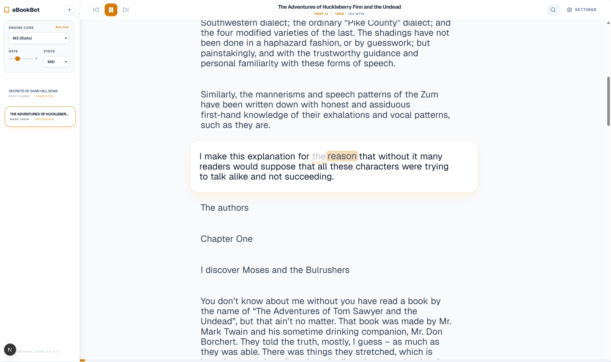

# eBookBot: Full-Stack Neural EPUB Reader

A premium, local-first EPUB reader with high-fidelity "Direct Neural" text-to-speech. Built with Next.js, FastAPI, and ONNX.

## 🚀 Overview

eBookBot converts your EPUB books into immersive audio experiences. It uses a Flow-Matching based TTS engine (`ReaderAudioEngine`) to generate natural speech with precise word-level synchronization.

TTS model in use: [Supertone/supertonic-2](https://huggingface.co/Supertone/supertonic-2).



## Highlights

- Local-first pipeline with fast, responsive playback.
- Word-sync highlighting aligned with neural audio.
- Fine-grained reading controls for layout and tempo.
- Modular architecture: Next.js UI + FastAPI API + ONNX TTS engine.

## Stack

| Layer | Technology |
| --- | --- |
| Frontend | Next.js (App Router) |
| Backend | FastAPI |
| TTS Engine | ONNX Runtime + ReaderAudioEngine |
| TTS Model | Supertone/supertonic-2 |

## 📖 How to Use

### Requirements
- Python 3.10+
- Node.js 18+
- ONNX Runtime (CUDA recommended for GPU acceleration, works on CPU too)

### Backend Setup (ReaderAudioAPI)
```bash
cd ReaderAudioAPI
pip install -r requirements.txt
python -m uvicorn app.main:app --reload
```

### Frontend Setup (reader-frontend)
```bash
cd reader-frontend
npm install
npm run dev
```

### Adding Books
1. Open [http://localhost:3000](http://localhost:3000).
2. Click the **+** (Plus) icon in the sidebar.
3. Upload an EPUB file and wait for processing.
   - Tip: You can purchase high-quality EPUBs from official bookstores or find catalogs on community sites like [Free Media Collection](https://fmhy.net/reading).
4. Select the book and click Play.

## Storage Notes

An average book requires about 400 MB of local storage (audio + cache). We will optimize this in the future; see TODO below.

## ⚙️ Features

- **Dynamic Controls**
  - Precise sliders for **Reading Size**, **Line Height**, **Word Spacing**, and **Chunk Gaps**
  - **Tempo** control (0.5x to 3.0x)
- **Instant Playback**: Iterative chunking lets you start instantly while the rest builds in the background.
- **Word-Sync**: Visual highlighting tracks the neural audio in real time.

---

## 🛠 ReaderAudioEngine (Submodule)

The core engine is included as a submodule. It is responsible for:
- Auto-downloading models from HuggingFace.
- Low-latency ONNX inference.
- Estimating precise word timestamps for highlighting.

To contribute or find more details about the engine, visit the `ReaderAudioEngine/` directory.

## TODO

- [ ] Optimize per-book storage size (target below ~100 MB).
- [ ] Add audio compression or streaming for long books.
- [ ] Provide a cleanup tool for cached audio.

## License

Free to use, copy, and modify. Commercial use is not permitted.

## Contact

| Type | Details |
| --- | --- |
| Author | Izzet Sezer |
| Email | sezer@imsezer.com |
