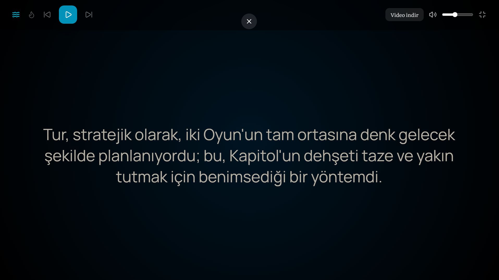

# Sesli_Kitap

EbookBot, EPUB formatındaki kitapları sıradan bir robotik sesle değil, metnin duygusuna göre tepki veren gelişmiş bir yapay zeka sistemiyle sesli kitaba dönüştüren bir otomasyondur. Statik seslendirmelerin aksine, Llama 3 ve XTTSv2 entegrasyonu ile metindeki bağlamı analiz eder.

Özellikler

  -Dinamik Duygu Analizi (Llama 3): Metin parçaları seslendirilmeden önce Llama 3 modeline gönderilir. Gelen duygu durumuna (mutlu, üzgün, gergin vb.) göre XTTSv2 parametreleri (speed, temperature, top_p) ve referans ses dosyaları anlık olarak güncellenir.

  -Çoklu Ses Desteği (Multi-Voice): Aynı metin dosyası içerisinde farklı karakterler veya bölümler için birden fazla referans ses dosyası (ref_audio) aynı anda kullanılabilir.

  -MP4 Export: Sadece ses dosyası değil, metin ve sesin senkronize olduğu video formatında çıktı alabilme.

  -Canlı Metin Akışı: Seslendirme sırasında işlenen metnin arayüz üzerinden eş zamanlı takibi.

-Ambiyans Modları: Okuma deneyimini zenginleştirmek için "Okyanus" ve "Ateş Başında" gibi arka plan ses katmanları.

Teknik Mimari:

  -Proje, yerel kaynakları (Local LLM & TTS) kullanarak gizlilik ve özelleştirme odaklı çalışır:

  -TTS Engine: XTTSv2 (Coqui AI)

  -LLM (Orchestrator): Llama 3 (model: llama3.1:8b-instruct-q5_K_M)

  -Backend: FastAPI / Python

  -Frontend: Next.js

  -DB:SqlLite

  -Processing: Metin parçalama (tokenization), duygu haritalama ve ses sentezleme döngüsü.

İş Akışı:

  -Frontend  Epub dosya ve seslendirme (default olarak canan ve mert ekli) sanataçısı seçilir.

  -Metin Ön İşleme (Books Sınıfı): Yüklenen EPUB dosyası ayıklanır, gereksiz karakterlerden temizlenir ve mantıksal bölümlere ayrılır.

  -Granüler Parçalama (Epub Sınıfı): Seslendirme sırasında kopukluk yaşanmaması için metin, noktalama işaretleri baz alınarak 150-180 karakterlik optimal bloklara bölünür.

  -Duygu Analizi & Metadata (Llama 3 Entegrasyonu): Her metin bloğu Llama 3 modeline gönderilerek duygu tespiti yapılır. Belirlenen duygu durumu (neşe, korku, hüzün vb. ne kadar duygu isterseniz eklenir) veritabanına işlenir.

  -Dinamik Sentezleme (TTS Sınıfı): * Veritabanındaki duygu etiketine göre XTTSv2 parametreleri (speed, temperature, top_p) anlık güncellenir.

  -İlgili duyguya uygun referans .wav dosyası seçilir.

  -Metin, bu dinamik ayarlarla seslendirilir.

  -Finalize: Ses parçaları birleştirilir, seçildiyse ambiyans sesleri (okyanus/ateş) eklenir.

https://www.youtube.com/watch?v=2Bp7w19-9kk (örnek seslendirme)

Kurulum:

1. Adım: CUDA Toolkit ve Sürücü Kontrolü : (XTTS v2 ~2B parametreli bir modeldir. CPU’da çalıştırmak pratik değildir. NVIDIA GPU + CUDA şarttır.)

  -(NVIDIA ekran kartı (RTX 20xx ve üzeri önerilir)

  -Güncel NVIDIA Driver

  -CUDA 11.8 (PyTorch uyumlu sürüm)

  -pip install torch torchvision torchaudio --index-url https://download.pytorch.org/whl/cu118 ( sanal ortam önerilir!! python -m venv venv  -venv\Scripts\activate)
    
   -python -c "import torch; print('GPU Hazır mı?:', torch.cuda.is_available()); print('Cihaz:', torch.cuda.get_device_name(0) if torch.cuda.is_available() else 'Yok')" kurulum başarılıysa ekran kartınızı ve GPU    görmeniz gerkiyor False geliyorsa: driver / CUDA / PyTorch uyumsuzdur)

3. Adım : XttsV2 modelini kurun
   -pip install TTS
   -pip install librosa soundfile

4. Adım : Ollama'yı İndirin ve Kurun
   
   -Web Sitesi: ollama.com adresine gidin.

   -İşletim sisteminize uygun (Windows/Linux/Mac) versiyonu indirin ve kurulumu tamamlayın.

   -Kurulum bittiğinde sağ alt köşede (sistem tepsisinde) Ollama simgesini görmelisiniz.

   -termianlden ollama run llama3 yazın (llama3.1:8b-instruct-q5_K_M benim tercih ettiği model ekran kartınızın gücüne göre daha güclü veya zayıf modelleri tercih edebilsiniz)
   
   Daha güçlü GPU varsa:

    -llama3.1:8b-instruct-q8_0

   Daha zayıf GPU:

    -llama3.1:7b-q4

   - llama_emotion.py sınıfını açın indirdiğiniz llama modelinin portunu (default olarak http://localhost:11434 adresinde çalışır) ve "model": "llama3.1:8b-instruct-q5_K_M", bilginizi güncelleyin.
  
5. FFmpeg (ZORUNLU – Video & Audio işlemleri)

    -“Static build” indirin
    - ffmpeg -version (kontorol edin)

    -ffmpeg.exe PATH’e ekleyin
    veya proje içinde otomatik tespit edilen pathi kullanın. 

6. Adım Backendi çalıştırın
   - cd ReaderAudioAPI
   - pip install -r requirements.txt
   - python -m uvicorn app.main:app --reload
  
8. Frontent:
   -cd reader-frontend
   -npm install
   -npm run dev

   
 Uyarılar :

   Disk Alanı

  XTTS model + ses dosyaları çok yer kaplar En az 20–30 GB boş alan önerilir

 Kitaplar neden uzun sürüyor?

  - Metinler Llamya duygu tespiti için gönderilir
  
  - Her duyguda ses doyası ve ayarlar tekrar güncellenir

  - XttsV2 büyük bir model ekran kartını zorlar

    ** ortalama 408 sayfalık bir kitap 4000 parçaya ayrılır her parça hem Llama ya hemde XttsV2 ye gider ortalam 8Gb ekran kartında 5-6 saat.
  

 CPU’da çalışır mı?

  -Teknik olarak evet

  -Pratikte hayır (çok yavaş, önerilmez bir kitap ı çevirmesi birkaç gün sürebilir)

  Ayarlamalar :

  Seslendirmenin kalitesi tamemen aşadığıdaki 3 şarta bağlıdır 

   Referans Ses Hazırlığı (Speaker Reference)
   XTTSv2, bir seslendirme modeli olarak "sıfırdan eğitim" (training) gerektirmez; bunun yerine "Zero-Shot Voice Cloning" yöntemini kullanır. Bu, modele verdiğiniz kısa bir ses örneğinin (ref_audio)   karakteristiğini anlık olarak kopyalaması demektir.

   En İyi Performans İçin Altın Kurallar:
   Ses Temizliği: Kullanacağınız ses dosyası tamamen temiz olmalıdır. Arka planda müzik, rüzgar sesi, yankı veya başka insanların sesi bulunmamalıdır.

   Kaynak Önerisi: Temiz ses örnekleri için Nowanda gibi profesyonel seslendirme kanallarındaki "sesli kitap" videolarını kullanabilirsiniz.

   Süre Optimizasyonu: * Minimum: 6 saniye. Maksimum: 15 saniye.

   İdeal: 10 saniye. (10 saniyenin üzerindeki kayıtlar performansı artırmaz, aksine işlem süresini uzatabilir.)

   Format: Dosyaları .wav formatında, mümkünse 22050Hz veya 44100Hz örnekleme hızında kaydedin. Uı ekranından veya manuel olarak speakers klasörüne ekleyebilrisiniz. (elle ekleyecekseniz duygu yu ekleyin canan_excited.wav şeklinde )
  

Ses Sentezleme İnce Ayarları (Fine-Tuning):

  1. Speed (Hız)
   Sesin ne kadar hızlı veya yavaş üretileceğini belirler.

   Aralık: 0.5 ile 2.0 arası.

   İdeal: 0.8 - 1.2

   Etki: * Artarsa: Konuşma hızlanır. Angry (Öfkeli) veya Excited (Heyecanlı) duygular için hızı artırmak (örn: 1.1 - 1.2) daha doğal sonuç verir.

   Azalırsa: Konuşma yavaşlar. Sad (Üzgün) veya Serious (Ciddi) bölümlerde hızı düşürmek (örn: 0.9) duyguyu derinleştirir.

  2. Temperature (Sıcaklık)
   Modelin yaratıcılığını ve sesin varyasyonunu belirler.

   Aralık: 0.01 ile 1.0 arası.

   İdeal: 0.65 - 0.85
 
   Etki: * Artarsa: Ses daha fazla "duygu patlaması" ve tonlama farkı içerir. Ancak çok artarsa ses çatallanabilir veya kekemelik yapabilir.

   Azalırsa: Ses daha monoton ve stabil hale gelir. Teknik metinler veya nötr anlatımlar için düşürülmelidir.

 3. Top_P (Nucleus Sampling)
   Modelin kelime ve ses tonu seçerken ne kadar geniş bir olasılık havuzuna bakacağını belirler.

   Aralık: 0.0 ile 1.0 arası.

   İdeal: 0.75 - 0.90

   Etki: * Artarsa: Ses daha zengin ve akıcı olur, kelimeler arasındaki geçişler yumuşar.

   Azalırsa: Model sadece en yüksek olasılıklı (en güvenli) ses tonlarını seçer. Bu, sesin daha net ama daha cansız çıkmasına neden olabilir.

   ** Bunlar gibi perk çok ince ayar yolu var . Ancak en ideal olarak bulunan ayarlar bu 3 seçenek ile ayarlamak çok fazla ayar değiştirldiğinde ses fazla boğuk , anlamsız arka plan sesleri , halisülasyon görme olmayan şeyleri seslendirme gibi problemler ortaya çıkıyor .
   https://docs.coqui.ai/en/latest/finetuning.html tüm ayarları burada bulabilirsiniz 
   https://github.com/coqui-ai/TTS/discussions bu tartışma alanında daha fazla bilgi alabilrsiniz 

   

 Duygu Analizi ve Ses Kütüphanesi Özelleştirme
  - Sistem varsayılan olarak dört ana duygu durumu üzerine kurgulanmıştır: happy, sad, neutral ve excited. Ancak, projenizin edebi derinliğini artırmak için bu sınırları genişletebilirsiniz.
   
 1. Yeni Duygular Ekleme
   Sisteme "şaşkınlık" veya "öfke" gibi yeni duygular tanımlamak isterseniz iki noktada güncelleme yapmanız gerekir:

   LLM Katmanı: llama_service içindeki self.system_prompt alanını düzenleyerek Llama 3'e bu yeni duyguları da tanımasını ve analiz etmesini söylemelisiniz.

   TTS Katmanı: TTSService sınıfındaki emotion_settings sözlüğüne, yeni duygunun speed, temperature ve top_p değerlerini eklemelisiniz.

   Kritik Uyarı: Duygu sayısını artırmak, modelin analiz hassasiyetini zorlayabilir. Birbirine çok yakın duygular (örn: "üzgün" ve "çok üzgün") Llama 3 tarafında karışıklığa ve yanlış ses parametrelerinin seçilmesine neden olabilir. Optimizasyon için duyguların birbirinden keskin farklarla ayrılması önerilir.

 2. Otomatik Ses Hazırlama (video_parcalayici.py)
  Referans sesleri manuel olarak kesip biçmekle uğraşmanıza gerek yok. Hazırladığımız otomasyon sayesinde:

  İndirdiğiniz temiz ses kaydında (YouTube vb.), seslendiren kişinin ilgili duyguyu en iyi yansıttığı anları (dakika:saniye formatında) belirleyin.

  video_parcalayici.py dosyasındaki segments listesine bu zaman aralıklarını ve duygu ismini girin.

  Sınıfı çalıştırdığınızda, sistem videoyu parçalara bölecek, sesi ayıklayacak ve doğrudan app/speakers/ klasörüne uygun isimle ({voice_id}_{emotion}.wav) kaydedecektir.

İleri Seviye Özelleştirme: "Sinematik Seslendirme" Modu
    EbookBot sadece bir anlatıcı değil, bir yönetmen gibi davranabilir. Projenizi bir üst seviyeye taşımak için şu yaklaşımları uygulayabilirsiniz:

  1. Çoklu Karakter (Multi-Character) Desteği
  Kitabı monoton bir dış ses yerine, her karakterin kendi sesiyle konuştuğu bir sesli tiyatroya dönüştürebilirsiniz.

  LLM Stratejisi: Llama 3 modeline gönderilen promptu güncelleyerek, metindeki konuşmanın kime ait olduğunu (örn: "Anlatıcı", "Erkek Karakter", "Kadın Karakter") tespit etmesini isteyin.

  TTS Dinamikleri: TTSService sınıfında her karakter ismi için farklı bir voice_id ve buna bağlı referans ses dosyaları (.wav) tanımlayın. Böylece sistem, karakter değiştikçe otomatik olarak ses rengini de     değiştirecektir.

 2.  Akustik Tutarlılık (Acoustic Consistency)
   Sinematik bir deneyim için en büyük risk, seslerin "farklı dünyalardan" geliyormuş gibi duyulmasıdır.

   Kayıt Ortamı: Referans ses olarak kullandığınız tüm örneklerin aynı akustik ortamda kaydedilmiş olmasına dikkat edin.

   Neden Önemli?: Eğer erkek karakteri stüdyo kaydı bir videodan, kadın karakteri ise rüzgarlı bir dış çekimden alırsanız; dinleyici her karakter değişiminde mekanın da değiştiği hissine kapılır ve bu da atmosferi oldukça kötü etkiliyor.

  Altın Kural: En iyi sonuç için tüm referans sesleri aynı seslendirme sanatçısının farklı karakterleri canlandırdığı tek bir uzun videodan veya aynı stüdyoda kaydedilmiş farklı videolardan toplayın.
  

 Dinamik Çevresel Akustik (Dynamic Environmental Acoustics)
   Kitaptaki karakterin sadece duygu durumuna göre değil, içinde bulunduğu mekana göre sesinin dokusunu değiştiren bir sistem hayal edin.

  Mekan Algılı" Ses İşleme
  
   Llama 3'ten sadece duyguyu değil, sahnenin geçtiği lokasyonu da analiz etmesini isteyebilirsiniz. (Örn: Mağara, kütüphane, orman, boş bir oda, yağmur altı.)

  Nasıl Çalışır?:

   Llama 3 metni analiz eder ve bir environment etiketi döner (Örn: environment: "large_hall").

   TTS sesi sentezledikten sonra, bu ses dosyası üzerine otomatik bir Reverb (Yankı) veya EQ (Ekolayzır) filtresi uygulanır.

   Mağarada geçen bir sahnede ses daha derin ve yankılı gelirken, kütüphanede geçen bir sahnede ses daha boğuk ve "yakın" duyulur.
     
  

 

